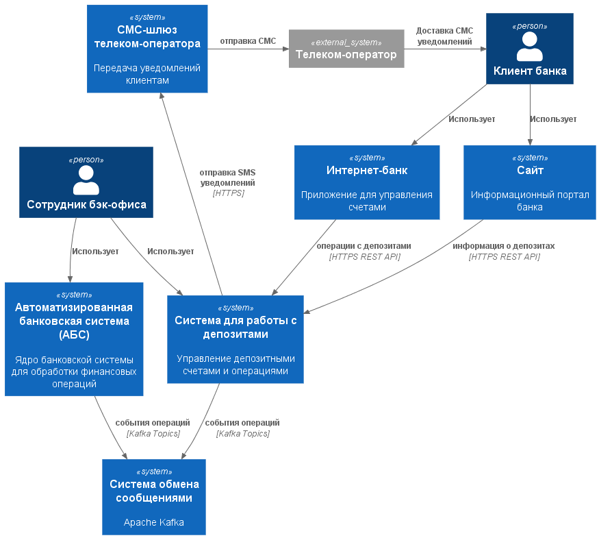
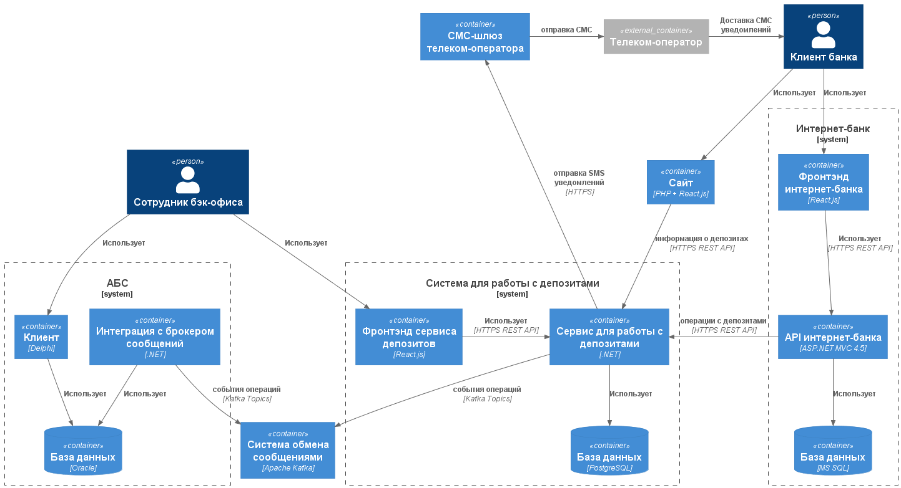

### **Название задачи: открытие депозитов онлайн** 
### **Автор: Никитин В.Г.**
### **Дата: 24.05.2026**
### **Функциональные требования**

|**№**|**Действующие лица или системы**|**Use Case**|**Описание**|
| :-: | :- | :- | :- |
| UC1 | Клиент, Сайт | Подача заявки на депозит ||
| UC2 | Клиент, Интернет-банк | Подача заявки на депозит ||
| UC3 | Сотрудник бэк-офиса | Обработка заявки на депозит ||

### **Нефункциональные требования**

|**№**|**Требование**|
| :-: | :- |
| R1  | Доступность 24/7, SLA 99.9%, SLO: downtime ≤ 43 сек/месяц |
| R2  | RTO ≤ 15 минут, RPO ≤ 5 минут |
| R3  | Резервирование в различных ЦОД |
| R4  | Backup policy: полный бэкап ежедневно, инкрементальный каждые 6 часов |
| R5  | Мониторинг: сбор метрик (Prometheus), логирование (ELK), alerting в реальном времени |
| R6  | Обработка отказов: graceful degradation, circuit breaker, retry logic (exponential backoff) |
| R7  | Возможность горизонтального масштабирования для нового функционала |
| P1  | Latency p50 < 100 мс, p95 < 300 мс, p99 < 500 мс |
| P2  | Latency p50 < 200 мс, p95 < 600 мс, p99 < 1000 мс |
| P3  | Throughput: минимум 1000 req/sec на endpoint депозитов |
| P4  | Kafka: latency < 100 мс |
| S1  | Использование существующих технологий банка |
| S2  | Разработка технической документации |
| S3  | Аудит: логирование всех операций с персональными данными |
| +R1 | Запрет на прямое взаимодействие интернет-банка с АБС |
| +R2 | Требуется шифрование при передаче персональных и платежных данных |
| +R3 | При необходимости асинхронного взаимодействия - использовать Kafka |
| +R4 | Обработка отказов Kafka |
| +R5 | Защита от DDoS и других сетевых атак |

### **Решение**

**Диаграмма контекста**

**Диаграмма контейнеров**

При выборе технологий ориентировался на существующие компетенции банка и требование совместимости.

Решение опирается на уже применяемый в банке стек, что позволяет:
- Снизить риски за счет отказа от новых технологий.
- Сократить затраты на освоение незнакомых систем.
- Задействовать внутреннюю экспертизу.

Система работы с депозитами включает:
- Сервис обработки депозитов.
- Фронтенд для сотрудников.
- Отдельную базу данных.

Сервис обменивается данными с АБС через интеграционный слой и систему обмена сообщениями (Kafka).

**Достоинства**:
- Разделение ответственности
- Надежное взаимодействие
- Буферизация при сбоях
- Снижение нагрузки на АБС
- Соответствие требованиям (+R1, +R3)

### **Альтернативы**

| № | Альтернатива | Описание | Достоинства | Недостатки |
|---|---|---|---|---|
| 1 | Встроить функционал в Интернет-банк | Добавить логику работы с депозитами непосредственно в существующее приложение Интернет-банка | • Минимум компонентов • Нет задержек на координацию между сервисами | • Рост сложности Интернет-банка • Сложнее тестировать • Сложнее масштабировать |
| 2 | Прямое синхронное взаимодействие сервиса с АБС | Сервис напрямую обращается к API/БД АБС для получения данных депозитов | • Минимум компонентов • Простая реализация | • Риск перегрузки АБС • Нарушает требование +R1 • Сложнее обеспечить отказоустойчивость • Нет буферизации при сбоях АБС |

**Недостатки, ограничения, риски**

- Усложнение архитектуры
- Консистентность данных (eventual consistency)
- Необходимость обработки задержек
- Автоматизация обработки заявок ограничена (требует участия сотрудника)

| № | Риск | Описание | Меры по снижению |
|---|---|---|---|
| 1 | Перегрузка АБС | Синхронное взаимодействие может привести к перегрузке АБС при пиковых нагрузках | Использование асинхронного взаимодействия через Kafka |
| 2 | Потеря данных в Kafka | Сообщения могут быть потеряны в случае критического отказа | Конфигурация Kafka с репликацией; сохранение данных в БД сервиса перед отправкой события |
| 3 | Рассинхронизация данных | Асинхронное взаимодействие может привести к временной рассинхронизации между сервисом и АБС | Разработка функционала с учетом eventual consistency |
| 4 | Недостаточная пропускная способность сервиса | При росте числа заявок сервис может стать узким местом | Горизонтальное масштабирование сервиса; использование кэширования; оптимизация БД |
| 5 | Сбой интеграционного слоя | Если интеграционный слой недоступен, нарушается связь с АБС | Высокая доступность интеграционного слоя; резервирование; мониторинг |
| 6 | Невалидные данные от клиента | Клиент может отправить невалидные или неполные данные | Валидация на фронтенде и бэкенде; обработка исключений в сервисе |