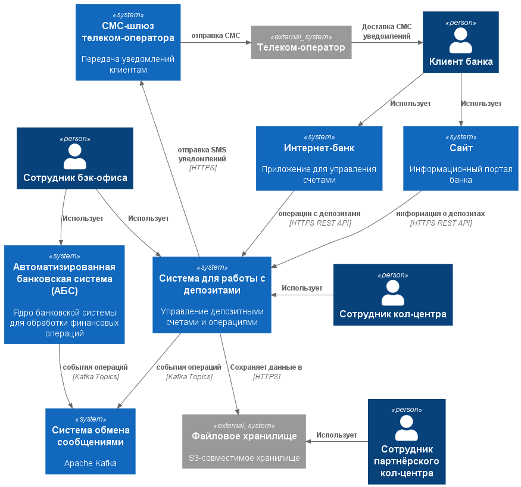
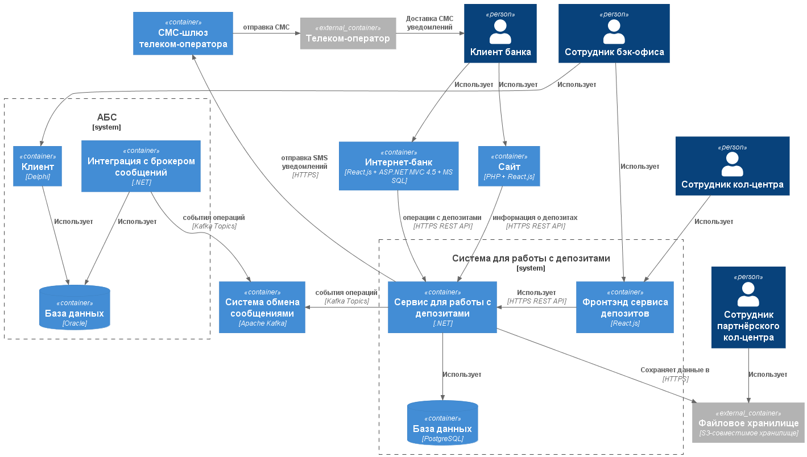

### **Передача ставок в кол-центр** 
### **Автор: Никитин В.Г.**
### **Дата: 24.05.2026**
### **Функциональные требования**

|**№**|**Действующие лица или системы**|**Use Case**|**Описание**|
| :-: | :- | :- | :- |
| UC1 | Оператор кол-центра | Получение информации о ставках по депозитам ||
| UC2 | Оператор партнерского кол-центра | Получение информации о ставках по депозитам ||

### **Нефункциональные требования**

|**№**|**Требование**|
| :-: | :- |
| +R1 | Кол-центр партнера работает во внешней информационной системе |
| +R2 | Единственный вариант передачи ставок - через файлы |
| +R3 | Система должна обеспечивать 99.5% времени доступности файлового хранилища |
| +R4 | Передача файла со ставками должна быть выполнена не более чем за 5 минут |
| +R5 | Все файлы должны передаваться по защищенному каналу (SFTP/HTTPS) с шифрованием в пути |
| +R6 | Должен быть механизм повторной отправки файла при ошибке передачи (не менее 3 попыток) |

### **Решение**

**Диаграмма контекста**

**Диаграмма контейнеров**

За основу взят предыдущий вариант архитектуры. Данное решение выбрано из-за простоты реализации.

Обоснование:
1. Высокая надежность.
2. Встроенные механизмы безопасности.
3. Легко масштабируется.
4. Автоматическое резервное копирование.

#### Файловое хранилище

**Тип хранилища:** Amazon S3 (или любое совместимое объектное хранилище)

**Характеристики:**
- **Форматы файлов:** CSV или XML (требует согласование с партнером)
- **Срок хранения:** 90 дней (далее архивирование)
- **Шифрование:** Включено (SSE-S3 или SSE-KMS)
- **Доступ:** SFTP gateway или HTTPS REST API

#### Процесс передачи ставок

1. Система расчета ставок генерирует файл с результатами
2. Файл записывается в S3 хранилище
3. Отправляется уведомление партнеру (например, email) со ссылкой на загрузку
4. Партнер может скачать файл через веб-интерфейс или SFTP
5. При ошибке передачи - автоматический повтор через 15 минут (max 3 попытки)

### **Альтернативы**

| Альтернатива | Описание | Достоинства | Недостатки |
| :- | :- | :- | :- |
| Прямой API | Разработать REST API для получения информации оператором партнерского кол-центра (по аналогии с собственным кол-центром) | Реал-тайм передача данных; лучше масштабируемость | Требует дополнительной разработки и поддержки; выше сложность интеграции для партнера |
| FTP/SFTP сервер | Организовать собственный FTP/SFTP сервер для передачи файлов | Полный контроль; широкая поддержка клиентами | Требует управления сервером; сложнее масштабировать; снижение безопасности |

**Недостатки, ограничения, риски**

- Зависимость от облачного провайдера
- Дополнительные затраты