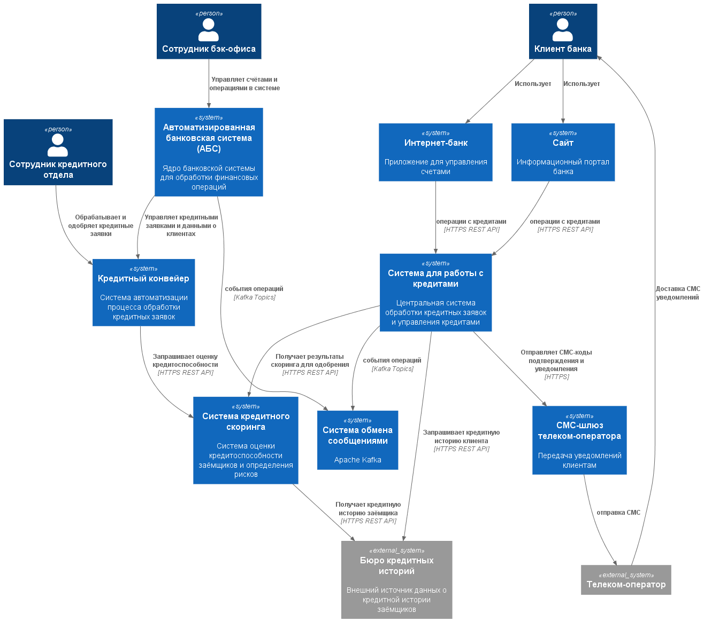
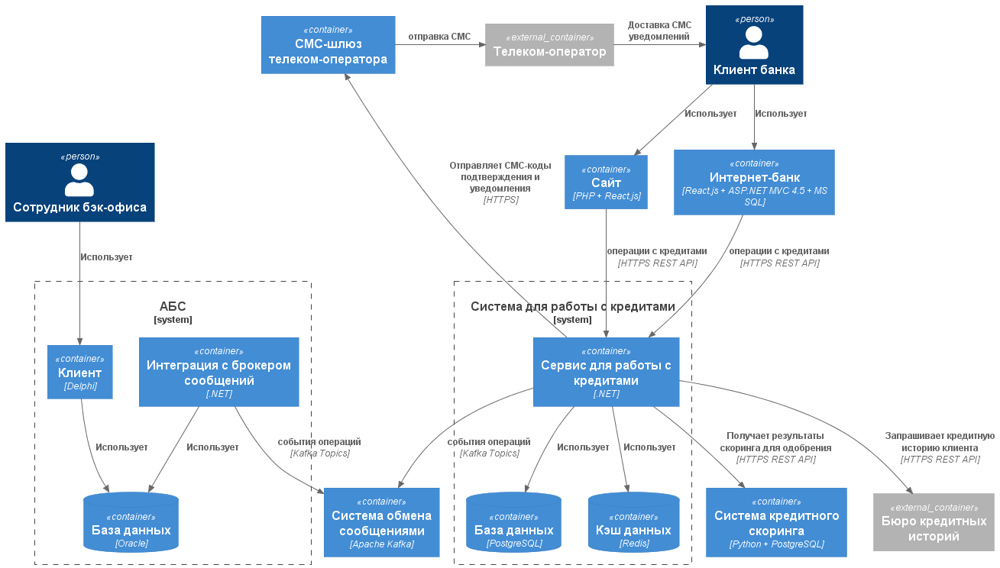

### **Заявка на кредит онлайн** 
### **Автор: Никитин В.Г.**
### **Дата: 26.05.2026**
### **Функциональные требования**

|**№**|**Действующие лица или системы**|**Use Case**|**Описание**|
| :-: | :- | :- | :- |
| UC1 | Клиент, Сайт | Подача заявки на кредит ||
| UC2 | Клиент, Интернет-банк | Подача заявки на кредит | Подтверждение через СМС |
| UC3 | Сотрудник бэк-офиса | Оформление заявки на кредит через АБС ||

### **Нефункциональные требования**

|**№**|**Требование**|
| :-: | :- |
| S1  | Использование существующих технологий банка |
| +R1 | Запрет на прямое взаимодействие интернет-банка с АБС |
| +R2 | Требуется шифрование при передаче персональных и платежных данных |
| +R3 | При необходимости асинхронного взаимодействия - использовать Kafka |
| +R4 | Обработка отказов Kafka |
| +R5 | Защита от DDoS и других сетевых атак |

### **Решение**

**Диаграмма контекста**

**Диаграмма контейнеров**

При выборе технологий ориентировался на существующие компетенции банка и требование совместимости.

Решение опирается на уже применяемый в банке стек, что позволяет:
- Снизить риски за счет отказа от новых технологий.
- Сократить затраты на освоение незнакомых систем.
- Задействовать внутреннюю экспертизу.

Система работы с кредитами включает:
- Сервис обработки кредитов.
- Отдельную базу данных.
- Отдельный кэш для снижения нагрузки.

### **Стратегия кэширования**

Для оптимизации производительности используется многоуровневое кэширование:

- **Кэширование справочников**: Условия кредитования, процентные ставки кэшируются в Redis с TTL 1 час.
- **Кэширование профилей клиентов**: Базовые данные клиента кэшируются для ускорения обработки заявок.
- **Кэширование результатов скоринга**: Результаты скорингового анализа сохраняются в Redis для избежания повторных запросов.

### **Инвалидация кэша**

Стратегия инвалидации:

- **TTL-инвалидация**: Автоматическое истечение кэша по времени жизни.
- **Явная инвалидация**: При одобрении/отказе заявки все связанные кэши очищаются.

**Интеграция со скорингом и БКИ**

Система интегрирована с внешними сервисами:

- **Сервис скоринга**: Сервис кредитов отправляет запрос на скоринг с данными клиента, получает рейтинг.
- **БКИ (Бюро Кредитных Историй)**: Запрос к БКИ выполняется для получения истории задолженностей.
- **Кэширование результатов**: Результаты скоринга кэшируются для снижения нагрузки на внешние системы.

**Безопасность персональных данных**

Реализованы многоуровневые меры защиты:

- **Шифрование в пути**: TLS 1.3 для всех каналов передачи, особенно при передаче ПД и платежных данных (требование +R2).
- **Шифрование в покое**: Чувствительные данные шифруются в БД.
- **Разделение доступа**: Отдельная БД для кредитов изолирует ПД от других систем.
- **Маскирование в логах**: Все логирование ПД исключено или замаскировано.

**Обработка нагрузки**

Архитектура спроектирована на масштабируемость:

- **Горизонтальное масштабирование**: Сервис кредитов развертывается на нескольких инстансах за балансировщиком.
- **Кэширование нагрузки**: Кэш снижает нагрузку на БД и внешние сервисы на 70-80%.
- **Rate limiting**: API сервиса ограничивает количество запросов для защиты от DDoS и злоупотреблений.
- **Изоляция**: Отдельная БД и кэш изолируют нагрузку от других систем банка.

**Альтернативы**

| № | Альтернатива | Описание | Достоинства | Недостатки |
|---|---|---|---|---|
| 1 | Встроить функционал в Интернет-банк | Добавить логику работы с кредитами непосредственно в существующее приложение Интернет-банка | • Минимум компонентов • Нет задержек на координацию между сервисами | • Рост сложности Интернет-банка • Сложнее тестировать • Сложнее масштабировать |
| 2 | Прямое синхронное взаимодействие сервиса с АБС | Сервис напрямую обращается к API/БД АБС для получения данных депозитов | • Минимум компонентов • Простая реализация | • Риск перегрузки АБС • Нарушает требование +R1 • Сложнее обеспечить отказоустойчивость • Нет буферизации при сбоях АБС |
| 3 | Интеграция с помощью Kafka | Полностью асинхронная архитектура на базе Kafka для всех операций | • Максимальная масштабируемость и отказоустойчивость | • Усложнение логики обработки • Сложность отладки |

**Недостатки:**
- Рост сложности системы за счет ввода новых сервисов и компонентов (отдельная БД, Redis).
- Необходимость обучения команды работе с выбранными технологиями.
- Увеличение операционных расходов на поддержку и мониторинг дополнительных компонентов.

**Ограничения:**
- Интеграция с Kafka возможна только для асинхронных операций, синхронные операции остаются уязвимы к перегрузкам.
- TTL кэша (1 час) может привести к выдаче устаревших данных о ставках в периоды частых изменений.
- Шифрование в БД добавляет вычислительную нагрузку и усложняет поиск по данным.
- Rate limiting на API может привести к отклонению легитимных запросов в периоды высокой активности.
- Изоляция на уровне БД требует синхронизации данных между системами.

**Риски:**
- **Точка отказа**: Отказ сервиса скоринга или БКИ блокирует обработку заявок.
- **Риск несогласованности данных** между кэшем и БД при сбое инвалидации кэша.
- **Безопасность ключей шифрования**: Необходимо надежное управление и хранение ключей.
- **Задержки в интеграции с БКИ**: Внешняя система может быть недоступна, требуется кэширование.